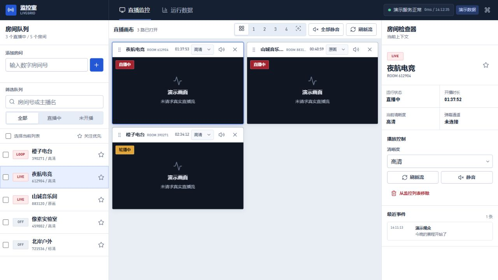

# LiveGrid / 监控室

LiveGrid 是一套本地直播监控工作台，中文产品名为“监控室”。项目保留本地服务协议，使用独立的 Electron 桌面外壳与可维护的 TypeScript 前端，并采用冷白调度台视觉风格。



## 下载

- [下载 LiveGrid 0.1.2 Windows x64 安装包](https://github.com/Bixers/LiveGrid/releases/download/v0.1.2/LiveGrid-0.1.2-setup.exe)
- SHA-256：`7E7A70239B2A4DF09C01D8F4C034CEF0CFC414019254215137BFA4D5BCBEABE7`

安装包暂未配置代码签名证书，Windows 可能显示“未知发布者”。

## 环境

- Node.js `>=22.12.0`
- pnpm `11.x`
- 本地直播服务默认监听 `http://127.0.0.1:8123`

## 运行

```powershell
pnpm install
pnpm dev
```

开发地址：`http://127.0.0.1:4175/`

不连接真实直播流的界面演示：`http://127.0.0.1:4175/?demo=1`

Web 生产构建：

```powershell
pnpm build
```

输出目录为 `dist/`。

## 桌面 EXE

生成 Windows x64 安装版：

```powershell
pnpm desktop:pack
```

成品输出到 `release/LiveGrid-0.1.2-setup.exe`。默认安装到 `%LOCALAPPDATA%\Programs\监控室`；选择其他父目录时，安装器会自动补上独立的 `监控室` 子目录。安装后直接运行 `LiveGrid.exe`，不再像单文件便携版一样每次解压约 455 MB 的 Electron 运行时。

仍需便携单文件时可执行 `pnpm desktop:pack:portable`，但未签名环境下每次启动都可能因临时解压和安全扫描出现较长等待。

首次启动会把随包后端复制到 `%APPDATA%\监控室\backend`，并自动迁移旧版的房间列表和代理配置。桌面启动日志位于 `%APPDATA%\监控室\desktop.log`。

当前本地构建未配置代码签名证书，Windows 可能显示“未知发布者”。正式分发前应使用受信任证书签名。

完整依赖、构建目录与发布步骤见 [BUILDING.md](BUILDING.md)。

## 主要改进

- 直播监控与运行数据双视图，桌面三栏上下文和窄屏抽屉布局。
- 房间搜索、状态筛选、关注优先、多选和批量打开/静音/移除。
- 自动、1/2/3/4 列和重点画面布局，支持拖动排序与键盘方向键排序。
- 清晰度切换、单路/全部静音、手动刷新、双击视频全屏。
- 本地保存已打开房间、关注、静音和布局偏好。
- 本地服务健康、请求延迟、空状态、失败状态和恢复反馈。
- 弹幕 SSE 事件检查器与 `/api/stats` 运行数据表。
- 命令面板与键盘操作；HLS/FLV 播放器按流格式懒加载。

## 本地接口

开发服务器将以下路径代理到 `127.0.0.1:8123`：

- `GET /streams.json`
- `GET /status`
- `GET /add?room=<id>`
- `GET /remove?room=<id>`
- `GET /refresh`
- `GET /quality?room=<id>&q=<OD|UHD|HD|SD>`
- `GET /danmaku?rooms=<id,id>`
- `GET /api/stats`
- `GET /api/events`

## 集成边界

桌面版使用 Electron 承载新界面，并复用提供程序中独立运行的本地服务二进制。由于没有原始 C# 工程和 Python 服务源码，旧外壳与后端没有被反编译重写；二次开发集中在可维护的 TypeScript 前端和新的桌面生命周期、静态资源服务及接口转发层。

## 归属与许可

界面中不再出现原产品名、原作者账户、会员等级或无关站点入口。第三方开源许可不属于可移除的产品归属；完整许可文本会随 `public/licenses/` 一起进入构建产物，详见 [THIRD_PARTY_NOTICES.md](THIRD_PARTY_NOTICES.md)。
